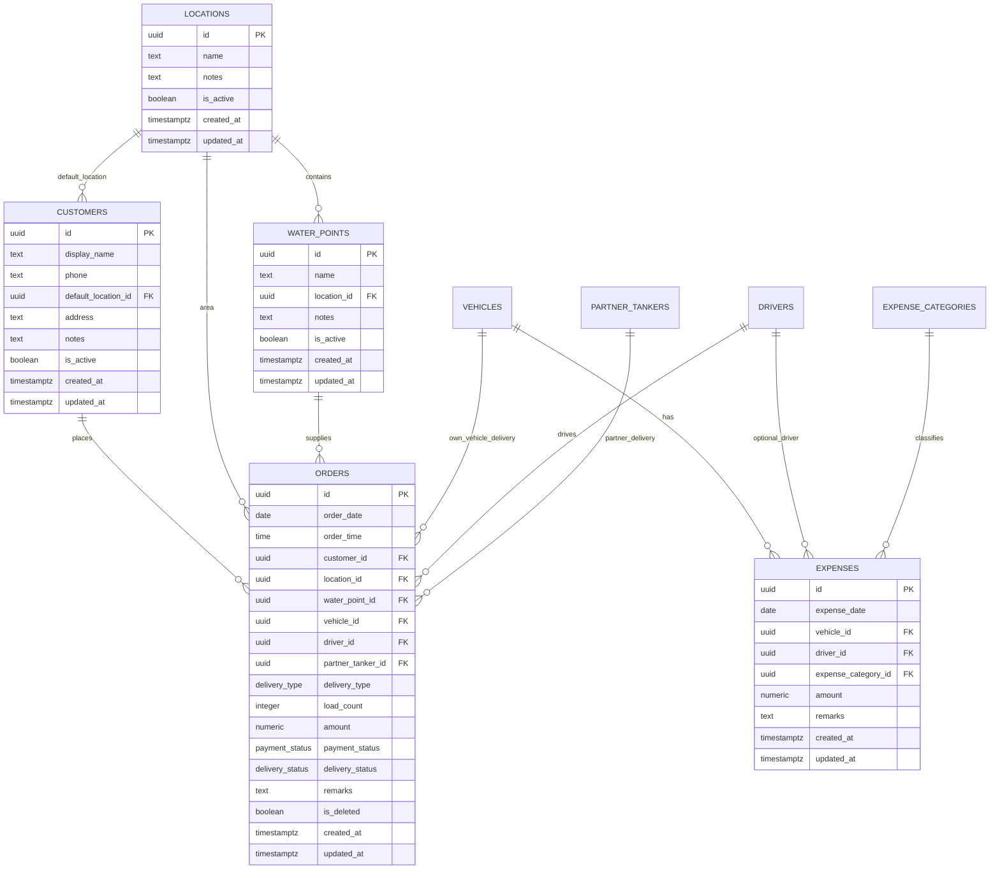

# AquaFlow Database Architecture

Phase 2 defines the PostgreSQL/Supabase database architecture only. It does not
connect Flutter to Supabase, implement CRUD, create providers, create
repositories, or add business logic.

## Database Philosophy

Orders are the operational aggregate root. Analytics must be calculated from
orders and expenses. AquaFlow must not store revenue summaries, dashboard
values, profit, pending amount, total orders, week, day, or month as persisted
business totals.

Master data follows the rule: enter once, reuse forever.

## Migration Files

- `supabase/migrations/001_initial_schema.sql`
- `supabase/migrations/002_indexes.sql`
- `supabase/migrations/003_views.sql`
- `supabase/migrations/004_rls.sql`
- `supabase/migrations/005_seed.sql`

## Database Diagram

## Table List

### Master Tables

- `customers`
- `drivers`
- `vehicles`
- `partner_tankers`
- `locations`
- `water_points`
- `expense_categories`
- `business_settings`

Each master table has a UUID primary key, `created_at`, `updated_at`, and
`is_active`.

### Transaction Tables

- `orders`
- `expenses`

`orders` includes `is_deleted` for soft deletion because historical order data
must remain available for future analytics and audit behavior.

## PostgreSQL Enums

- `payment_status`: `unpaid`, `partial`, `paid`
- `delivery_status`: `order_received`, `assigned`, `on_the_way`, `delivered`
- `vehicle_status`: `available`, `busy`, `inactive`
- `vehicle_type`: `tractor`, `canter`, `partner`
- `expense_type`: `diesel`, `driver_payment`, `service`, `repair`, `police`, `tyre`, `other`
- `delivery_type`: `own_vehicle`, `partner_tanker`

## Relationships

- `orders.customer_id` references `customers.id`.
- `orders.location_id` references `locations.id`.
- `orders.water_point_id` references `water_points.id`.
- `orders.vehicle_id` references `vehicles.id` for own vehicle deliveries.
- `orders.driver_id` references `drivers.id` for own vehicle deliveries.
- `orders.partner_tanker_id` references `partner_tankers.id` for partner deliveries.
- `customers.default_location_id` references `locations.id`.
- `water_points.location_id` references `locations.id`.
- `expenses.vehicle_id` references `vehicles.id`.
- `expenses.driver_id` optionally references `drivers.id`.
- `expenses.expense_category_id` references `expense_categories.id`.

## Constraints

- Amount must be greater than `0` on `orders` and `expenses`.
- Load count must be at least `1`.
- Order date is required.
- Order time is required.
- Customer is required.
- Location is required.
- Water point is required.
- Own vehicle orders require `vehicle_id` and `driver_id`.
- Own vehicle orders must not include `partner_tanker_id`.
- Partner tanker orders require `partner_tanker_id`.
- Partner tanker orders must not include `vehicle_id` or `driver_id`.
- Names and registration numbers cannot be blank.
- Vehicle registration numbers are unique.
- Partner tanker registration numbers are unique.
- Expense category `expense_type` is unique.

## Indexes

Orders:

- `idx_orders_customer_id`
- `idx_orders_order_date`
- `idx_orders_payment_status`
- `idx_orders_delivery_status`
- `idx_orders_vehicle_id`
- `idx_orders_driver_id`
- `idx_orders_partner_tanker_id`

Masters:

- `idx_locations_name`
- `idx_customers_display_name`
- `idx_customers_phone`
- `idx_drivers_phone`
- `idx_vehicles_registration_number`

Expenses:

- `idx_expenses_expense_date`
- `idx_expenses_expense_category_id`

## Views

All views calculate values. None of these summaries are stored.

- `todays_revenue`: delivered order revenue, order count, and load count for today.
- `todays_expenses`: expense total and count for today.
- `todays_profit`: today revenue minus today expenses.
- `pending_payments`: unpaid and partially paid orders.
- `monthly_revenue`: revenue, order count, and load count grouped by month.
- `vehicle_performance`: own vehicle order count, loads, and revenue.
- `driver_performance`: driver order count, loads, and revenue.
- `customer_summary`: total orders, delivered revenue, pending amount, and last order date per customer.

## RLS Policies

RLS is enabled on every table.

Version 1 has no login and is a single-owner app. The policies therefore allow
`anon` and `authenticated` roles to read and write tables. This matches the
current product requirement but is intentionally documented as a Version 1
tradeoff.

Before supporting multiple users, staff, or public distribution at scale, these
policies must be replaced with owner-scoped policies.

## Seed Data

Only static expense categories are seeded:

- Diesel
- Driver Payment
- Service
- Repair
- Police
- Tyre
- Other

No fake customers, orders, payments, revenue, vehicles, drivers, locations, or
partners are seeded.

## Future Scalability

This design keeps operational facts in `orders` and `expenses`, while reusable
business records live in master tables. That allows future reporting, dashboard
analytics, and export features to calculate from normalized source data.

Recommended future additions:

- Audit table for important edits and deletes.
- Storage bucket policy for receipt images or vehicle documents.
- Optional owner/account table if login is ever introduced.
- Database functions for frequently reused reporting ranges after CRUD is stable.
- Partial indexes for high-volume queries once real usage patterns are known.

## Recommendations Before CRUD

1. Confirm whether partner tanker orders should always omit own vehicle and driver.
2. Confirm whether expenses can apply to partner tankers later.
3. Decide whether order deletes should always be soft deletes.
4. Decide whether phone numbers should become unique after real data is reviewed.
5. Apply these migrations through Supabase migration tooling, not through manual table creation.
